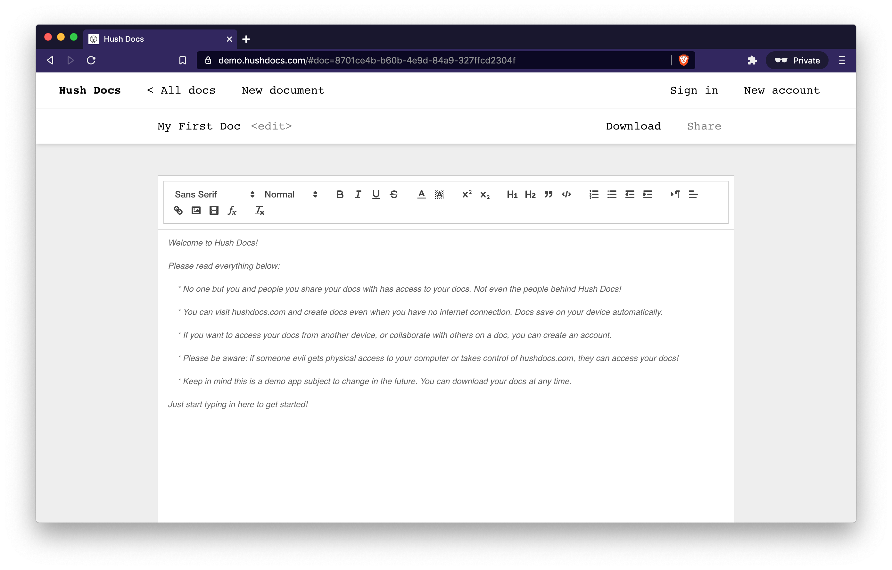

  

<h1 align="center" style="font-family: monospace;">Hush Docs</h1>

  <b>Private Google Docs alternative that works without internet.</b>

  

## How does it work?

Docs are stored in the browser using IndexedDB ([Dexie.js](https://dexie.org/)), so you can create and edit docs whenever you want, no internet or account needed. If you decide you want to sync across devices, or collaborate with others on a doc, you can create an account at any time. Docs are then end-to-end encrypted using [Userbase](https://userbase.com/), and remain in sync using CRDTs ([Automerge](https://github.com/automerge/automerge)). No server ever has access to the docs!

Visit the site and turn off your internet to give it a try!

## License

This project is released under the [MIT License](LICENSE).

## Credits

The awesome shushing emoji was designed by [OpenMoji](https://openmoji.org/) – the open-source emoji and icon project. License: [CC BY-SA 4.0](https://creativecommons.org/licenses/by-sa/4.0/#)